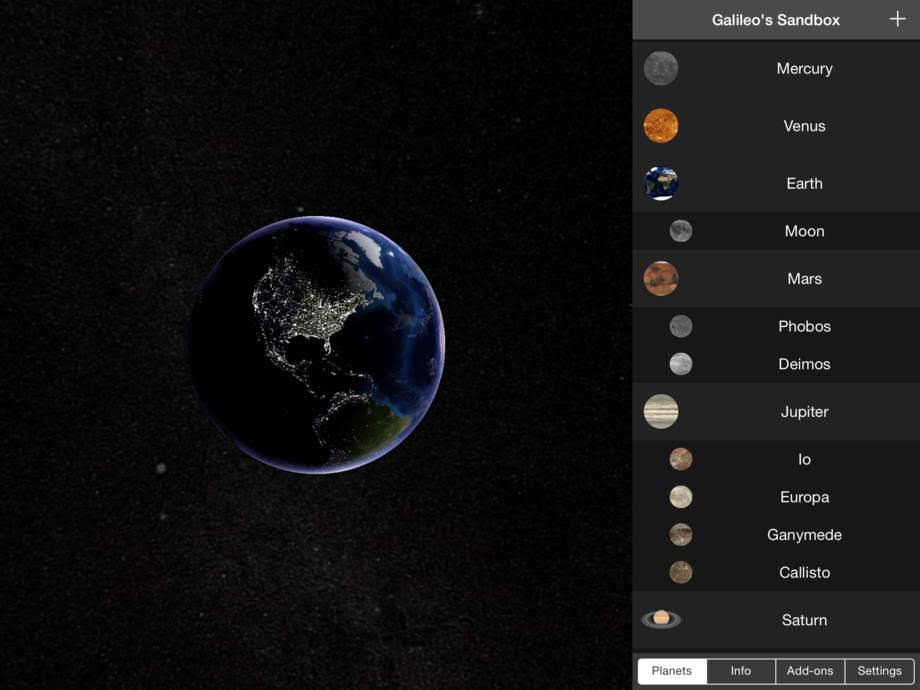
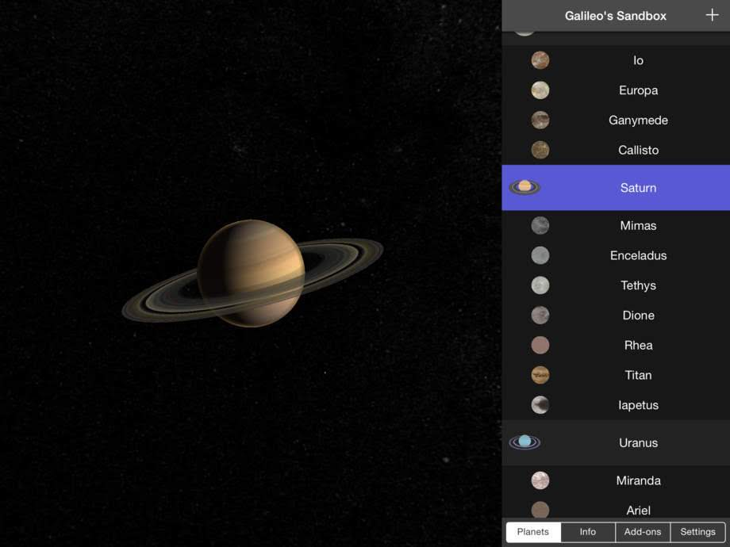
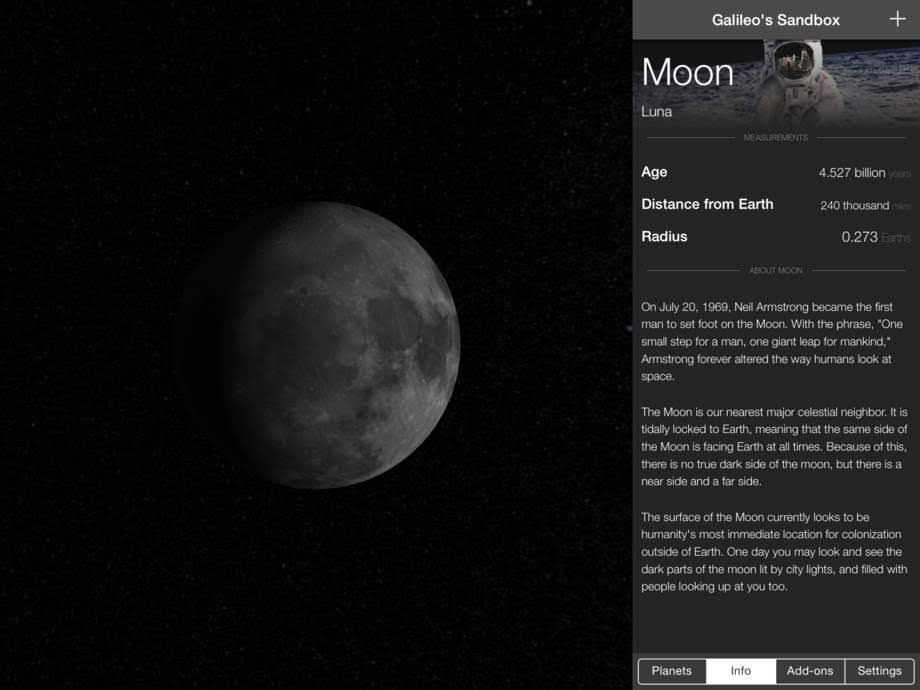
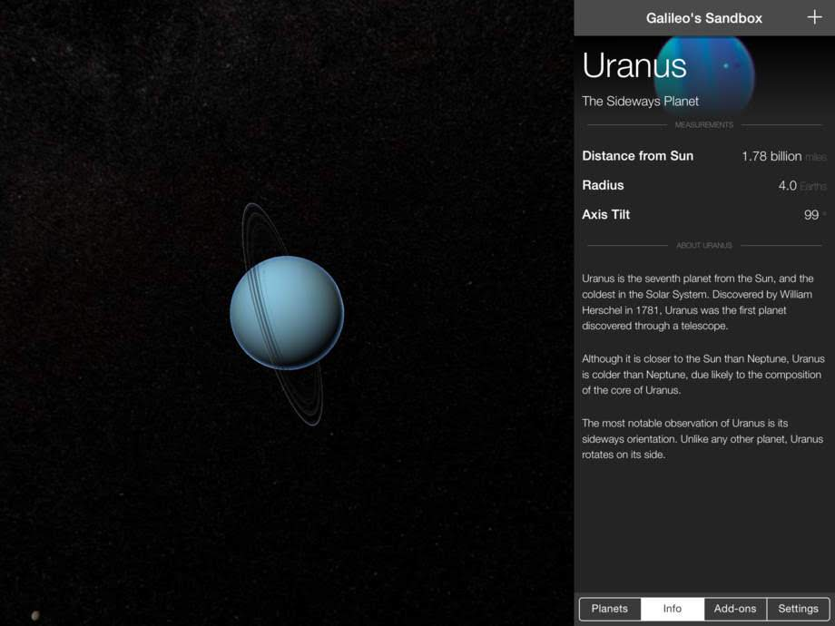
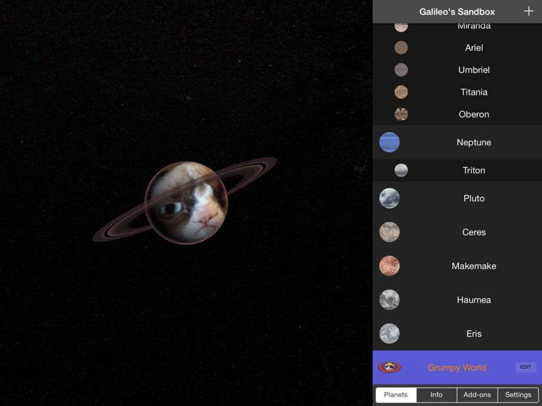

# Galileo's Sandbox
Galileo's Sandbox was an iPad app I made when I was a sophomore in high school, and launched to the App Store. It's built in Objective-C and C++, with pure OpenGL and linear algebra – no graphics engine – to render all of the planets and many of the moons in our solar system. In addition, the app had in-app purchases and custom planets with custom textures and colors.

The quality of the code isn't the best, but considering how young I was, I think the code is actually pretty good! Plus, the app turned out to be beautiful. I put a lot of work into the shaders for dynamic lighting and atmospheric glow. Screenshots below:

